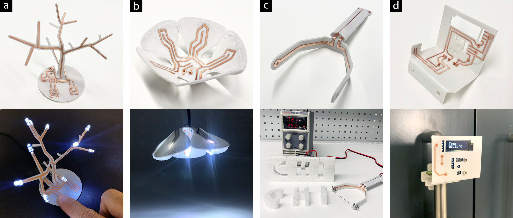

# Thermoformed-Circuit-Board
This is a github repository for TCB

This Github repository contains detailed research material of the published CHI 2021 conference paper titled Thermoformed Circuit Boards : Fabricating freeform 3D printed circuit boards using thermoplastic conductive filament and heat bending"

Research mateiral shared in this repository include:

1. Settings for 3D printer (PrsuaSlicer-2.0.0)

2. Grasshopper and Rhino6 templates

3. Materials and supplier list

4. Thermoforming "How-to"

5. Electroplating "How-to"

5. Component Assembly "How-to"

